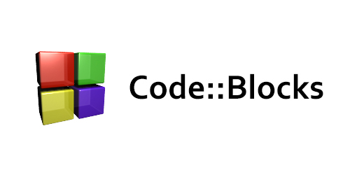

# Code-Blocks
My works related to Code::Blocks text editor.

# Express
My works related to Express web application framework for Node.js

## Table of Contents
1. [Introduction.](#introduction)
2. [Official references websites.](#references)
3. [GitHub notes.](#github)

<a name="introduction"></a>
## 1. Introduction.
 
Code::Blocks is a free C, C++ and Fortran IDE built to meet the most demanding needs of its users. It is designed to be very extensible and fully configurable. Code::Blocks is a free, open-source cross-platform IDE that supports multiple compilers including GCC, Clang and Visual C++. It is developed in C++ using wxWidgets as the GUI toolkit. Using a plugin architecture, its capabilities and features are defined by the provided plugins. Currently, Code::Blocks is oriented towards C, C++, and Fortran. It has a custom build system and optional Make support.

Built around a plugin framework, Code::Blocks can be extended with plugins. Any kind of functionality can be added by installing/coding a plugin. For instance, compiling and debugging functionality is already provided by plugins!

Code::Blocks is a free, open-source cross-platform IDE that supports multiple compilers including GCC, Clang and Visual C++. It is developed in C++ using wxWidgets as the GUI toolkit. Using a plugin architecture, its capabilities and features are defined by the provided plugins. Currently, Code::Blocks is oriented towards C, C++, and Fortran. It has a custom build system and optional Make support.

<a name="references"></a>
## 2. Official references websites. <br />
Code::Blocks official website : http://codeblocks.org <br />

<a name="github"></a>
## 3. GitHub notes.
Clone the current GitHub remote repository contents into local machine.
```
$ git clone https://github.com/syakirharis25/Code-Blocks.git
$ cd Code-Blocks/
$ git remote -v
$ git status
